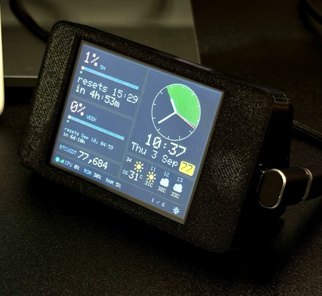

# Claude Code Usage Dashboard — for the "Cheap Yellow Display"



A little always-on desk display that shows your live Claude Code usage:

- **Current session** — how much of your 5-hour limit you've used, as a
  progress bar with the exact reset time (same numbers as `/usage` in
  Claude Code).
- **Current week** — same thing for your weekly limit.
- Plus more pages you can flip through by tapping the screen: top projects
  with a 7-day usage chart, a full `/usage`-style limits panel (context,
  credits, per-model week), device stats, optional cat GIFs from an SD
  card, and ambient Bangkok weather + BTC price on the home status page.

It runs on a **2.8″ ESP32 touch display** (nicknamed the "Cheap Yellow
Display" or CYD, model **ESP32-2432S028R**, ~$10 on AliExpress). Your Mac
runs a small helper program that reads your Claude Code data and shares it
over your home WiFi; the display fetches it every 20 seconds.

```
Your Mac  ──(WiFi, every 20s)──▶  CYD display on your desk
```

No cloud accounts, no API keys to create, nothing leaves your network
except the same usage check Claude Code itself already makes.

---

## What you need

| Item | Notes |
|---|---|
| The CYD board | ESP32-2432S028R, 2.8″ screen, micro-USB port |
| A micro-USB **data** cable | Important: some charging-only cables don't carry data. If in doubt, use the cable that came with a phone or camera. |
| A Mac with Claude Code installed | The one you normally use Claude Code on |
| Your WiFi name and password | The display and the Mac must be on the **same WiFi network** |
| About 30–45 minutes | Most of it is one-time software installation |

---

## Part 1 — Set up the helper program on your Mac (10 minutes)

The helper is one Python file: `server/usage_server.py`. It reads your
Claude Code logs, asks Anthropic for your current usage percentages (using
the login you already have — no new keys needed), and serves it all to the
display.

### Step 1.1 — Open Terminal

Press `Cmd + Space`, type **Terminal**, press Enter. You'll see a window
where you can type commands. For each command below: copy it, paste it
into Terminal, press Enter.

### Step 1.2 — Start the helper

```
/usr/bin/python3 ~/cyd/server/usage_server.py
```

You should see:

```
Serving usage stats on http://0.0.0.0:8787/api/usage
```

(Use `/usr/bin/python3` exactly as written — it's the version macOS ships
with, and it's the same one the auto-start in Step 1.5 uses. Running the
same one now means you only have to approve the keychain popup once.)

Leave this window open for now. The **first time** it runs, macOS may pop
up a window asking to allow access to **"Claude Code-credentials"** in your
keychain — click **Always Allow**. (This is how it reads your existing
Claude Code login to fetch the usage percentages; it never saves or sends
your login anywhere. If no popup appears, access is already granted —
nothing to do.)

### Step 1.3 — Check it's working

Open a **new** Terminal window (`Cmd + N`) and run:

```
curl http://localhost:8787/api/usage
```

You should see a block of text with numbers in it — your usage data. If
you see that, the helper works.

You can also open `~/cyd/simulator.html` in your web browser (just
double-click the file) — it shows a **simulated CYD screen** with your
real data, so you can preview exactly what the display will show before
you even plug in the board.

### Step 1.4 — Find your Mac's name on the network

The display needs to know how to find your Mac. Because a laptop's IP
address changes when it sleeps and reconnects, we use your Mac's **name**
instead (this is Apple's "Bonjour" feature — the name keeps working no
matter how the IP changes). Run:

```
scutil --get LocalHostName
```

It prints something like `Your-Mac-Name`. **Write this down and add
`.local` to the end** — so `Your-Mac-Name.local`. That's the address
you'll type into the display's settings in Part 2.

### Step 1.5 — Make the helper start automatically

So you never have to think about it again — it will start when the Mac
starts, and restart itself if it ever crashes:

```
cp ~/cyd/server/com.example.cydusage.plist ~/cyd/server/com.example.cydcontrol.plist ~/Library/LaunchAgents/
launchctl load ~/Library/LaunchAgents/com.example.cydusage.plist
launchctl load ~/Library/LaunchAgents/com.example.cydcontrol.plist
```

(The second one is the browser control panel — see "The control panel"
below. It gives you an on/off button, so you'll rarely need Terminal again.)

That's it. You can close all the Terminal windows. (If you ever want to
turn things off, open http://127.0.0.1:8788/ and click **Disable server**.)

---

## Part 2 — Set up the display board (first time, 25–35 minutes)

You'll install a free program called **Arduino IDE**, use it to put our
dashboard software onto the board through the USB cable (this is called
"flashing"), and then the board runs on its own forever — after the first
flash it only needs USB **power** (any phone charger works), not a
computer.

### Step 2.1 — Install Arduino IDE

1. Go to <https://www.arduino.cc/en/software> and download **Arduino IDE**
   for macOS.
2. Open the downloaded file and drag Arduino IDE into Applications, like
   any other Mac app.
3. Open it once. If macOS asks about permissions, allow them.

### Step 2.2 — Teach Arduino IDE about ESP32 boards

The CYD uses a chip called ESP32, which Arduino IDE doesn't know about
out of the box.

1. In Arduino IDE, open **Settings** (menu: `Arduino IDE → Settings…`).
2. Find the field **"Additional boards manager URLs"** and paste this in:
   ```
   https://raw.githubusercontent.com/espressif/arduino-esp32/gh-pages/package_esp32_index.json
   ```
3. Click OK.
4. Open the **Boards Manager**: click the second icon from the top in the
   left sidebar (looks like a circuit board), or menu
   `Tools → Board → Boards Manager…`.
5. Search for **esp32**, find **"esp32 by Espressif Systems"**, click
   **Install**. This downloads a few hundred MB — give it a few minutes.

### Step 2.3 — Install the two libraries we use

1. Open the **Library Manager**: third icon in the left sidebar (looks
   like books), or menu `Sketch → Include Library → Manage Libraries…`.
2. Search for **LovyanGFX** → Install. (Draws everything on the screen.)
3. Search for **ArduinoJson** → Install. (Reads the data from your Mac.)

If a popup asks "install dependencies?", click **Install All**.

### Step 2.4 — Enter your WiFi details

1. In Finder, go to `~/cyd/firmware/cyd_dashboard/`.
2. Duplicate the file `config.example.h` (click it, `Cmd + D`) and rename
   the copy to exactly: `config.h`
3. Open `config.h` in any text editor (TextEdit is fine — right-click →
   Open With) and fill in your details between the quotes:

   ```c
   #define WIFI_SSID     "YourWifiName"
   #define WIFI_PASSWORD "YourWifiPassword"
   #define SERVER_HOST   "Your-Mac-Name.local"  // ← your Mac's name from Step 1.4
   #define SERVER_PORT   8787                         // leave this as-is
   ```

4. Save the file. (Careful: keep the quote marks, and WiFi names are
   case-sensitive.)

### Step 2.5 — Plug in the board for the first time

1. Connect the CYD to your Mac with the micro-USB cable. The screen's
   backlight should come on (it may show garbage or an old demo — that's
   normal, we haven't put our software on it yet).
2. In Arduino IDE, open the file
   `~/cyd/firmware/cyd_dashboard/cyd_dashboard.ino`
   (menu `File → Open…`).
3. At the top of the window there's a dropdown for selecting the board.
   Click it → **Select other board and port…**
   - In the BOARD search box type **ESP32 Dev Module** and select it.
   - In the PORT list, pick the one that looks like
     **`/dev/cu.usbserial-XXXX`** or **`/dev/cu.wchusbserialXXXX`**.
   - Click OK.

**If no port shows up:** the CYD uses a USB chip (CH340) that older
versions of macOS don't recognise out of the box.

   - First, try a different USB cable — a charge-only cable is the #1
     cause.
   - macOS 12 (Monterey) and newer usually include the driver already.
     On older macOS, download the CH340 driver ("CH34x VCP driver for
     macOS" from the manufacturer WCH), install it, allow it in
     `System Settings → Privacy & Security`, and restart the Mac.

### Step 2.6 — Flash it

1. Click the round **→ (Upload)** button in the top-left of Arduino IDE.
2. The bottom panel will show it compiling (1–3 minutes the first time),
   then `Connecting...`, then percentage lines like `Writing at 0x...`.
3. When it says **"Hard resetting via RTS pin"** or **Done uploading** —
   you're finished.

**If it gets stuck on `Connecting.....___.....`:** hold down the button
labelled **BOOT** on the back of the board, click Upload again, and
release BOOT once the writing starts. (Some boards need this nudge the
first time.)

### Step 2.7 — Watch it come alive

After flashing, the board restarts by itself:

1. Screen shows **"Connecting to WiFi..."** for a few seconds.
2. Then the dashboard appears with your real usage numbers.

If the screen just shows cat GIFs instead, see Troubleshooting below.

### Step 2.8 — Move it to its permanent home

Unplug it from the Mac and plug it into **any USB phone charger**
anywhere in WiFi range. It reconnects and runs 24/7 on its own. (Your Mac
must be switched on and awake for the display to work — whenever it can't
reach the Mac, the screen switches to cat GIFs (or a placeholder), and
returns to the dashboard on the next successful poll after the Mac comes
back.)

---

## Using it

Tap the **right half** of the screen to go forward, the **left half** to
go back, across six pages:

| Page | Shows |
|---|---|
| **1. Status** (default) | Bangkok clock, session/week mini bars with a looping light sweep on the countdown, weather card (tap for a multi-hour / multi-day overlay), AQI badge, and BTC/USDT price |
| **2. Projects + 7-day trend** | Your most token-hungry projects over the last 7 days, plus a daily token bar chart |
| **3. Limits** | Full `/usage`-style panel: context window, 5h, weekly, per-model week, credits |
| **4. Cats** | Random cat GIFs from the SD card (`/cats/`), if present |
| **5. Mixed** | Limits card on the left, cats on the right |
| **6. Note** | Limits card on the left, your own text on the right — see [The Note page](#the-note-page-your-own-text-on-the-board) |

Two more screens are **tap-only**, not part of that cycle: the **Weather
overlay** (tap the weather card on page 1) and **Device Stats** (tap the
CPU/ROM/RAM line in the footer) — which is why the footer counter reads
"3 / 6" and not more.

The bottom edge shows the WiFi status, how fresh the data is
("updated 5s ago"), and which page you're on. Tap the **gear icon** in the
bottom-right corner to open **Settings** (brightness, poll rate,
battery save, night mode, and more). If the board can't reach your Mac
for about a minute of failed polls, the screen switches to cat GIFs (or
the cats placeholder) until the connection comes back.

---

## The control panel (see the helper's status in your browser)

Open **http://127.0.0.1:8788/** in any browser on your Mac. You get a
live status page that answers "is everything working?" at a glance:

- **RUNNING / STOPPED** pill and a one-click **Enable / Disable server**
  button (disabling switches the board to cat GIFs; enabling brings it back
  within one 20-second poll — nothing to do on the board itself).
- **Battery save** — force on, force off, or reset to auto (follow AC power).
  When save is active, the Mac slows its background work and the board (in
  AUTO) floors its poll interval to about 2 minutes.
- **Board heartbeat** — the board's IP and how many seconds ago it last
  fetched data. "alive" in green means the board is polling normally.
- **Diagnostics checklist** — six pass/fail checks (launchd job, process,
  port, data freshness, keychain limits, board polling).
- **Live logs** — the helper's log files, refreshed every 4 seconds. Each
  line in the left panel is one poll from the board.

This page is served by a second tiny helper (`server/control_server.py`)
that was installed the same way as the main one
(`server/com.example.cydcontrol.plist` in `~/Library/LaunchAgents/`). It
only listens on your Mac itself (127.0.0.1) — other devices on your WiFi
cannot reach it, because it has the power to stop and start the server.

---

## The Note page (your own text on the board)

Page 6 shows whatever text you want — a reminder, a to-do list, a phone
number — next to your usage limits. There are two ways to write it, and
both talk to the same place, so it doesn't matter which you use.

**From the terminal** (fastest):

```
python3 note.py                      # opens your editor on the current note
python3 note.py --show               # see it the way the board will draw it
python3 note.py "back at 3pm"        # set it in one shot
python3 note.py --append "- milk"    # add a line
pbpaste | python3 note.py -          # set it from the clipboard
python3 note.py --size 2             # bigger text on the board (1, 2 or 3)
python3 note.py --clear              # wipe it
```

Editing uses whatever `$EDITOR` you already like (vim, nano, `code -w`…).
Worth an alias, since you'll type it often:

```
alias note='~/cyd/note.py'           # add to ~/.zshrc, then: note --show
```

**From a browser:** open **http://127.0.0.1:8787/** for the same thing with
a mouse — a plain monospace editor that saves as you type.

A few things to know:

- **The board's font is ASCII-only.** Thai, emoji and accented letters have
  no shape to draw, so they're stored as `?`. Both editors tell you how many
  characters that affected rather than silently dropping them.
- **Long notes get cut off, not scrolled.** The pane fits 24 characters
  across and 19 lines down at size 1 (12 x 10 at size 2, 8 x 7 at size 3).
  `--show` draws the real box and marks where the text runs out; the browser
  editor warns you in words.
- **Text is colour-coded** the same way in the terminal, the browser and on
  the board: `# headings`, `> quotes`, `-`/`*`/`+` bullets, `TODO`/`FIXME`/
  `BUG` in red, `DONE`/`OK` in green, numbers in yellow, and `` `code` `` in
  blue. Keywords must be UPPERCASE to count, so ordinary prose stays plain.
- **Only your Mac can change the note.** Other devices on your WiFi get a
  403 — the board reads it, but nothing on the network can write it.
- Changes reach the board on its next poll (about 20 seconds by default).

---

## Troubleshooting

**The whole screen just shows cat GIFs**
- This is normal and expected whenever your Mac is **asleep or off** —
  the board switches to cats, and the dashboard comes back on the next
  successful poll after the Mac wakes up. You don't need to do anything.
- If it stays on cats even when the Mac is awake, work through:
- Is the helper running? (Test on the Mac with
  `curl http://localhost:8787/api/usage` in Terminal. If Part 1 Step 1.5
  is done, it starts automatically — but you can re-run that step.)
- Does `SERVER_HOST` in `config.h` exactly match your Mac's name from
  Step 1.4, including the `.local` at the end?
- Are the board and the Mac on the same WiFi network? (Guest networks
  are often walled off from the main one.)

**Screen stuck on "Connecting to WiFi..."**
- WiFi name or password typo in `config.h` — they're case-sensitive.
- The ESP32 only supports **2.4 GHz** WiFi. If your router has separate
  5 GHz-only network names, use the 2.4 GHz one.

**Usage percentages show "--"**
- The helper couldn't read your Claude Code login from the keychain yet.
  If a keychain popup appeared, make sure you clicked **Always Allow**
  (Step 1.2). The helper retries about every two minutes on AC, so it
  usually fixes itself.
- The token counts and dollar totals below still work even when this shows
  "--", since those come from your local logs rather than the login.

**Touch doesn't change pages**
- A small number of CYD units use a different touch chip (capacitive
  GT911 instead of the usual resistive XPT2046). If tapping does nothing
  at all, you likely have that variant — the touch settings in `pins.h`
  need changing. Ask for help with "my CYD has GT911 touch".

**Want to test without the board?**
- Open `simulator.html` in your browser. It's a pixel-accurate simulation
  of the display, fed by the same helper — click the screen to change
  pages, and use its panel to simulate the server being offline, change
  the poll speed, or view the raw data.

---

## Using it with a laptop that sleeps

You don't need to keep your Mac running like a server — this is designed
for a normal laptop that sleeps and wakes many times a day:

- **When the Mac sleeps**, the board can't reach it, so it switches to cat
  GIFs. Nothing to do.
- **When the Mac wakes**, the helper resumes automatically and the board
  reconnects on its own — the dashboard reappears within ~20 seconds. You
  never touch anything.
- **The board finds your Mac by name, not by IP address.** This matters:
  laptops usually get a *different* IP each time they rejoin WiFi, which
  would strand a board that was pointed at a fixed IP. Using the `.local`
  name (Step 1.4) sidesteps that completely.
- **Self-healing:** if the board's own WiFi ever gets wedged (rare, but it
  can happen on a device left running for weeks), it automatically reboots
  itself after ~15 minutes offline and reconnects. Set it up once, leave
  it plugged into a charger, and forget about it.

Requirements for this to work: the board and Mac must be on the **same
WiFi network**, and it must be a normal home/office network (not a
"client isolation" guest network that blocks devices from seeing each
other).

## Good to know

- **Usage percentages and reset times are the real thing** — fetched from
  the same place Claude Code's `/usage` command gets them, using your
  existing Claude Code login (read from the Mac's keychain at runtime;
  never written to disk, never sent anywhere except to Anthropic).
- **Dollar figures are estimates.** They're computed from your local logs
  with an approximate price table by model family
  (in `usage_server.py`) — useful for comparing days, not for billing.
- **The light sweep on the countdown bars** — that looping shine gradient
  across the green bars on the Status and Home pages — is pure polish. It's a subtle
  visual indicator that the board is alive and animating smoothly, running
  in parallel with the 20-second data updates.
- **Privacy:** the helper serves data to any device on your home network
  (port 8787). It exposes usage statistics only — token counts,
  percentages, project folder names — never conversation content or
  credentials.
- Everything on the Mac side is one Python file using only what ships
  with macOS — nothing to install, no dependencies to break.

## Appendix — compile & flash from the command line (advanced)

If you'd rather not use the Arduino IDE GUI (Part 2), you can build and
flash with `arduino-cli`. This is also the fastest way to just *check that
the firmware compiles* without a board attached. Verified working with
arduino-cli 1.5.1, esp32 core 3.3.10, LovyanGFX 1.2.24, ArduinoJson 7.4.3.

**One-time setup:**

```
brew install arduino-cli
arduino-cli config init
arduino-cli config add board_manager.additional_urls \
  https://raw.githubusercontent.com/espressif/arduino-esp32/gh-pages/package_esp32_index.json
arduino-cli core update-index
arduino-cli core install esp32:esp32          # large download, a few minutes
arduino-cli lib install LovyanGFX ArduinoJson
```

Then create your `config.h` (copy `config.example.h` and fill it in) as in
Part 2, Step 2.4.

**Compile only (no board needed) — verifies the code builds:**

```
arduino-cli compile --fqbn esp32:esp32:esp32:PartitionScheme=huge_app ~/cyd/firmware/cyd_dashboard
```

A healthy build ends with a line like `Sketch uses 1322355 bytes (42%) of
program storage space.` (The sketch uses 42% of the 3 MB app partition under
the `huge_app` scheme — comfortable headroom for now.)

**Compile and flash to the board in one step:**

```
arduino-cli board list                        # find the port, e.g. /dev/cu.usbserial-10
arduino-cli compile --fqbn esp32:esp32:esp32:PartitionScheme=huge_app,UploadSpeed=115200 \
  --upload -p /dev/cu.usbserial-10 ~/cyd/firmware/cyd_dashboard
```

Replace the port with the one `board list` shows for your board (looks
like `/dev/cu.usbserial-XXXX` or `/dev/cu.wchusbserialXXXX`). If the upload
stalls at `Connecting...`, hold the board's **BOOT** button, re-run, and
release it once writing starts — same trick as the GUI (Step 2.6).

> Compiling proves the code is correct for the ESP32 toolchain. It does
> **not** prove the display wiring or touch calibration — those can only be
> confirmed on the physical board once it's flashed and running.

## Files in this project

```
cyd/
├── README.md                       ← you are here
├── simulator.html                  browser-based simulator of the display
├── server.html                     browser control panel (status, on/off, logs)
├── note.html                       browser editor for the Note page (page 6)
├── note.py                         terminal editor for the same note
├── pull_giphy_cats.py              downloads cat GIFs for the Cats page
├── prepare_cat_gifs.py             resizes/optimises them for the board
├── server/
│   ├── usage_server.py             the helper program (Python, no dependencies)
│   ├── control_server.py           serves the control panel on 127.0.0.1:8788
│   ├── com.example.cydusage.plist   auto-start recipe for macOS
│   └── com.example.cydcontrol.plist auto-start recipe for the control panel
└── firmware/cyd_dashboard/
    ├── cyd_dashboard.ino           setup() + loop(): touch, rendering, the two cores
    ├── pages.cpp                   every screen the board draws
    ├── net.cpp                     WiFi, polling the Mac, parsing the JSON
    ├── gif_player.cpp              the cat GIF player
    ├── settings.cpp                the on-device Settings area
    ├── sd_store.cpp                saved settings + SD card files
    ├── ap_setup.cpp                first-boot WiFi setup portal
    ├── format.cpp                  number/date formatting helpers
    ├── state.h                     shared constants and the STATE struct
    ├── pins.h                      which wires go where on this exact board
    ├── config.example.h            template for your WiFi details
    └── config.h                    your actual WiFi details (you create this; never shared/committed)
```
