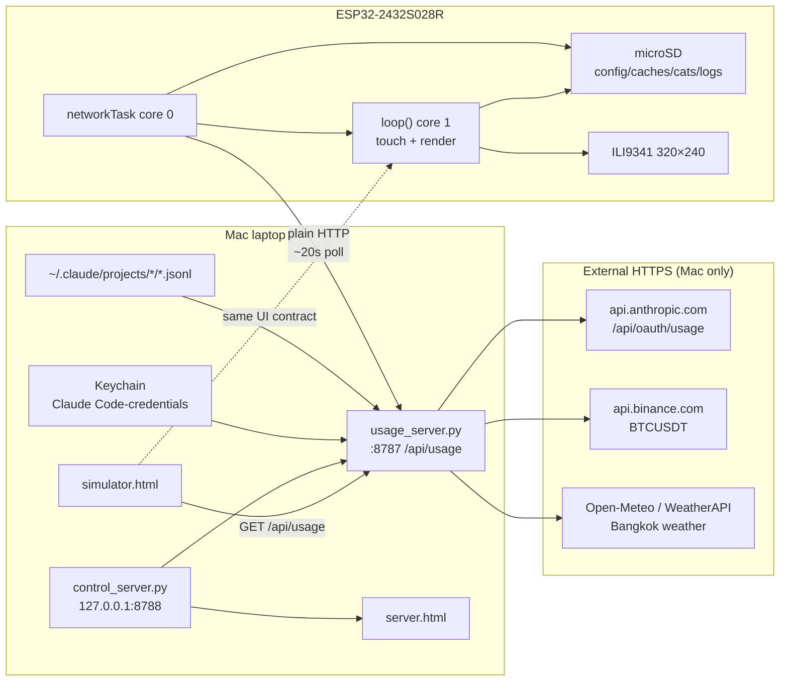
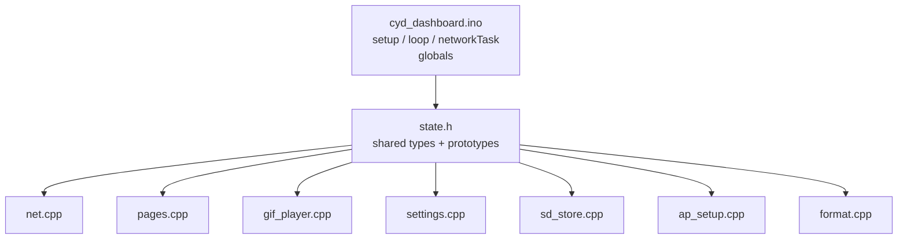
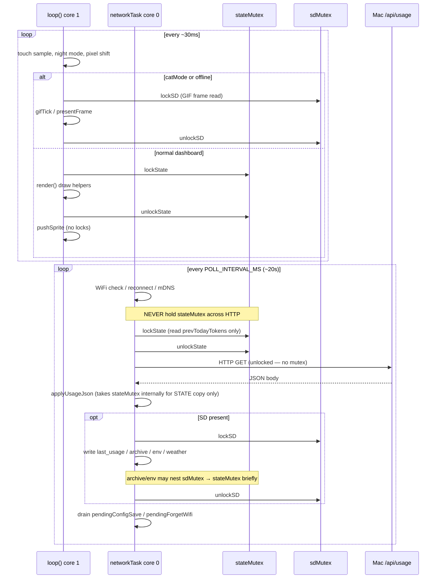
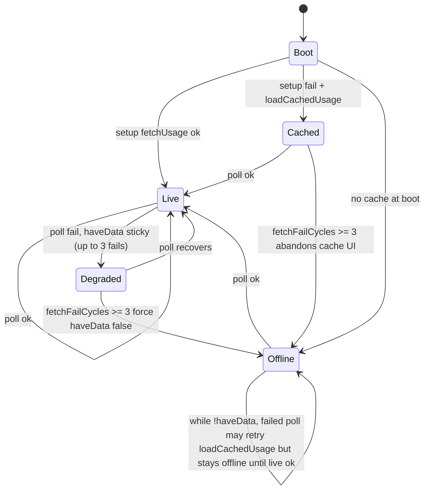
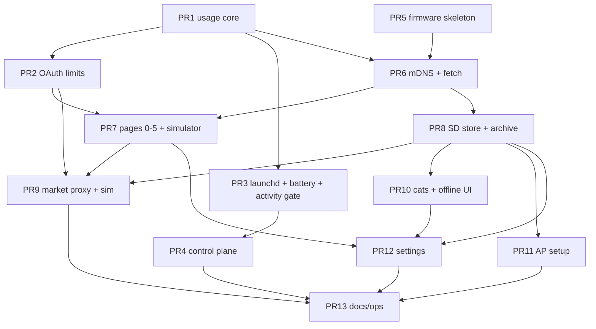

# CYD Claude Code Token-Usage Dashboard — System Design

| Field | Value |
|---|---|
| **Title** | CYD Claude Code Token-Usage Dashboard — System Design |
| **Author** | CYD project maintainers |
| **Date** | 2026-07-20 |
| **Status** | Accepted (as-built) |
| **Scope** | End-to-end architecture **and** on-device visual design system (as-built) |
| **Primary sources** | `CLAUDE.md`, `README.md`, `server/`, `firmware/cyd_dashboard/` (`state.h`, `pages.cpp`, `settings.cpp`, `format.cpp`), `simulator.html` |
| **Workspace** | `/Users/eunitembam3/cyd` |
| **Branch context** | `feat/sd-cats-and-market-proxy` (SD cat GIFs + Mac-side market proxy) |

---

## Overview

This document describes the **as-built architecture** of a personal, always-on desk dashboard that shows live Claude Code usage on an ESP32-2432S028R “Cheap Yellow Display” (CYD): a 2.8″ 320×240 landscape resistive-touch panel. The system has three cooperating parts:

1. **Mac usage server** (`server/usage_server.py`) — stdlib Python process that tails `~/.claude/projects/*/*.jsonl`, reads plan limits from Anthropic’s OAuth usage endpoint via Keychain credentials, proxies BTC (Binance) and Bangkok weather (Open-Meteo / optional WeatherAPI), and serves a single JSON contract at `GET /api/usage` on port **8787**.
2. **ESP32 firmware** (`firmware/cyd_dashboard/`) — Arduino sketch that joins home WiFi, discovers the Mac by Bonjour name, polls `/api/usage` every ~20s over **plain HTTP**, and renders **8 touch-cycled pages** plus offline cats, settings, and a first-boot AP portal.
3. **Browser simulator** (`simulator.html`) — pixel-faithful stand-in for the board UI against the same endpoint (except real GIF playback).

A separate **control panel** (`server/control_server.py` + `server.html` on **127.0.0.1:8788**) can load/unload the usage LaunchAgent without exposing launchctl to the LAN.

The design intentionally keeps **all TLS off the board** (no PSRAM; 154KB framebuffer leaves insufficient contiguous heap for mbedTLS), keeps **UI touch/render non-blocking** (network task on core 0, loop on core 1), and treats **firmware ↔ simulator parity** as a hard invariant so layout work can be verified without hardware.

**Visual design** is constrained by a 320×240 landscape ILI9341 panel and the built-in classic GFX bitmap font: a dark near-black chrome, orange accent hierarchy, green “healthy/live” signals, and dense card layouts with large glanceable numbers. Tokens, spacing, buttons, touch targets, and icons are specified in [Visual Design System](#visual-design-system-ui) and must stay lockstep between `pages.cpp` / `settings.cpp` and `simulator.html`.

---

## Background & Motivation

### Problem

Claude Code users need a glanceable view of:

- 5-hour and weekly plan utilization (the same numbers as in-CLI `/usage`)
- Session context window fill
- Today’s spend estimate and top projects
- Optional ambient desk data (BTC, local weather)

Cloud dashboards and phones break the “desk glance” habit; running a second UI inside the terminal is noisy. A cheap always-on panel that lives on the LAN solves this without new API keys or cloud accounts.

### Current state (implemented)

| Concern | Implementation |
|---|---|
| Auth to Anthropic | Reuse existing Claude Code Keychain item `Claude Code-credentials`; never store tokens in this repo |
| Token accounting | Incremental scan of local jsonl with stream-rewrite dedupe |
| Board reachability of Mac | mDNS `.local` host, not fixed IP |
| Board HTTPS | None — Mac proxies market data into `/api/usage` |
| Mac sleep on battery | `battery_guard_loop` closes the listening socket when battery ≤50% on battery power |
| Offline UX | Cat GIFs + large “OFFLINE” banner (not a frozen last frame forever) |
| First setup without reflash | SoftAP captive portal → `/config.json` on SD |

### Pain points the architecture already addresses

| Pain | Mitigation |
|---|---|
| Mac laptop IP changes after sleep | Server discovery via `SERVER_HOST` mDNS; re-resolve on fetch failure |
| Touch freezes during slow HTTP | All blocking I/O on FreeRTOS `networkTask` core 0 |
| TLS + framebuffer OOM on board | Zero `WiFiClientSecure`; BTC/weather in usage JSON |
| Doubled token totals from streaming | Dedupe on `(message.id, requestId)`, keep-first |
| Unbounded in-memory event lists | 5-minute buckets, 8-day retention |
| Continuous 20s polls prevent Mac sleep on battery | Battery guard unbinds HTTP server |
| UI regressions hard to spot without hardware | `simulator.html` + Playwright screenshot |
| Flash too small for features | Always flash `PartitionScheme=huge_app` (3MB app) |

---

## Goals & Non-Goals

### Goals

1. **Glanceable fidelity** — session/week percents and reset times match Claude Code’s `/usage` (OAuth source of truth).
2. **Set once, leave on** — board recovers from WiFi/Mac outages; optional SD holds config, caches, diagnostics, cats.
3. **Local-first privacy** — usage logs never leave the Mac except the same OAuth call Claude Code already makes; board traffic is LAN HTTP only.
4. **Simulatable UI** — any non-GIF page change is verifiable in-browser with the same coordinates/fonts/colors.
5. **Operable on stock macOS** — `/usr/bin/python3` (3.9.6), stdlib only for launchd jobs; no Homebrew runtime dependency for the server.
6. **Hardware-honest** — design within CYD constraints: 4MB flash, ~320KB DRAM, no PSRAM, three separate SPI buses (display / touch / SD).

### Non-Goals

- Multi-user SaaS, accounts, or remote hosting of the dashboard.
- On-device Anthropic API calls or OAuth.
- OTA firmware updates (partition trades OTA for a larger app slot).
- Exact dollar billing (costs are **estimates** from a hardcoded price table).
- Pixel-faithful GIF playback in the simulator.
- Support for capacitive GT911 CYD variants without pin/config changes.
- Windows/Linux host servers (design assumes macOS Keychain + launchd + Bonjour).
- General-purpose home automation platform.

---

## Proposed Design (As-Built Architecture)

### High-level topology



### Component map

| Component | Path | Role |
|---|---|---|
| Usage server | `server/usage_server.py` | Data aggregation + market proxy + HTTP API |
| Usage LaunchAgent | `server/com.corner.cydusage.plist` → `~/Library/LaunchAgents/` | KeepAlive process; logs `/tmp/cydusage.{log,err}` |
| Control server | `server/control_server.py` | Local status + enable/disable |
| Control LaunchAgent | `server/com.corner.cydcontrol.plist` | KeepAlive on 8788 |
| Control UI | `server.html` | Operator page (not firmware-parity bound) |
| Simulator | `simulator.html` | Browser twin of board UI |
| Firmware entry | `firmware/cyd_dashboard/cyd_dashboard.ino` | setup/loop/networkTask + globals |
| Shared decls | `firmware/cyd_dashboard/state.h` | LGFX, `UsageState`, mutexes, prototypes |
| Pins | `firmware/cyd_dashboard/pins.h` | TFT / XPT2046 / SD pin map |
| Config template | `firmware/cyd_dashboard/config.example.h` | WiFi + server host/port |
| Network | `firmware/cyd_dashboard/net.cpp` | WiFi, mDNS, `fetchUsage`, caches, archive |
| Pages | `firmware/cyd_dashboard/pages.cpp` | All dashboard drawing + `render()` |
| GIF player | `firmware/cyd_dashboard/gif_player.cpp` | Cat library + frame pacing |
| Settings | `firmware/cyd_dashboard/settings.cpp` | Hidden settings table-driven UI |
| SD store | `firmware/cyd_dashboard/sd_store.cpp` | Config, daily log, diag, splash BMP |
| AP setup | `firmware/cyd_dashboard/ap_setup.cpp` | First-boot captive portal |
| Format helpers | `firmware/cyd_dashboard/format.cpp` | Token/cost/BTC/countdown formatting |
| Cat prep | `prepare_cat_gifs.py` | Download/resize GIFs for SD `/cats/` |

### Firmware module split

The sketch was split out of a single ~3k-line `.ino` so translation units stay reviewable. Arduino only auto-prototypes the primary `.ino`; **all cross-file symbols are declared in `state.h`**.



### Display pages (8)

| Index | Function | Content |
|---|---|---|
| 0 | `drawStatusPage` | Analog clock, 5h/week mini bars (shine sweep), countdown wedge, BTC tile, weather card (`WEATHER_HIT_*` 150–210×170–216; tap → weather overlay) |
| 1 | `drawProjectsPage` | Top projects (7d) + 7-day token trend chart |
| 2 | `drawHomePage` | Large session + week limit blocks + BTC line |
| 3 | `drawDevicePage` | Board stats (flash, RAM, SD, WiFi, CPU duty proxy) |
| 4 | `drawLongTrendPage` | 30-day on-device history from `/daily_log.csv` |
| 5 | `drawLimitsPage` | Context, 5h, weekly all/per-model, credits (`/usage`-style) |
| 6 | GIF_PAGE | Full-screen random cats from SD `/cats/*.gif`; firmware-only `drawSessionResetOverlay()` (session % + reset time, bottom-left, textSize 2) when limits known |
| 7 | MIXED_PAGE | Split layout + partial `pushImage` (see geometry below) |

**MIXED_PAGE geometry** (`presentFrame` / `gifTick` in `pages.cpp` + `gif_player.cpp`):

| Region | Pixels | Content |
|---|---|---|
| Left half | x 0–159, full height | Limits card (`drawMixedPageStatic`); shine strip may direct-write panel at x ≤ 134 |
| GIF band | x 160–303, y 0–219 | Cat frames (dirty-band push via `gifMinY`/`gifMaxY`) |
| Footer band | y 220–239 (full width; right strip 160–303 pushed with left) | Footer / mixed chrome; GIF clips to `max_y = 220` in mixed mode |

**Overlays / modes (not swipe pages):**

- **Weather overlay** (`weatherPageOpen`) — tap weather card on page 0 (`WEATHER_HIT_*`); any tap dismisses.
- **Settings** (`SET_LIST` / `SET_LEAF`) — tap footer connection pulse hit-box (`PULSE_HIT_*` 0–40×214–240); list is **drag-to-scroll** (not page-flip pagination).
- **Offline** — after `OFFLINE_AFTER_CYCLES` (3) consecutive failed polls, `haveData` is forced false → cat mode + `drawOfflineBanner()` (even if SD cache still exists).
- **AP setup** — boot-only, firmware-only, not in simulator parity.

### Dual-core concurrency model

Source of truth: `fetchUsage` / `applyUsageJson` in `net.cpp`, `networkTask` / `loop` in `cyd_dashboard.ino`.



**Critical rule:** never hold `stateMutex` across `http.GET` (or any network wait). Doing so freezes `render()` for the full connect/read budget — the multi-minute touch freeze dual-core was built to eliminate. `applyUsageJson` self-locks only for the brief STATE field copy after the body is already in RAM; `fetchUsage` owns the SD block (`lockSD` around cache/archive/env/weather writes).

**Locking rules (must not regress):**

| Mutex | Protects | Holders | Nesting |
|---|---|---|---|
| `stateMutex` | `STATE`, `longTrend[]` during cross-core access | `applyUsageJson` (internal brief copy); `networkTask` for tiny reads (e.g. `prevTodayTokens`); `render()` while drawing | Non-recursive; draw helpers must not re-lock |
| `sdMutex` | HSPI/SD bus | `networkTask` (writes inside `fetchUsage` / config save), GIF player on core 1 (reads) | Only allowed nest: **`sdMutex` → `stateMutex`** (e.g. `appendArchiveRow` / `saveEnvCache` under `fetchUsage`). Never take `sdMutex` while holding `stateMutex` (would block `render`) |

**Cross-core visibility without `stateMutex` (volatile / direction matters):**

| Field | Writer | Reader | Notes |
|---|---|---|---|
| `STATE.haveData` | core 0 (`networkTask`) | core 1 | Sticky until fail-cycle offline |
| `connected` | core 0 | core 1 | Footer / progress line |
| `lastPollMs` | core 0 | core 1 | Progress line |
| `POLL_INTERVAL_MS` | **core 1** (Settings `applyPollInterval`) | **core 0** | Poll cadence; volatile |
| `pendingConfigSave`, `pendingConfigKeyId`, `pendingConfigValue` | **core 1** (settings) | **core 0** | Generic SD save queue |
| `pendingForgetWifi` | **core 1** | **core 0** | Erase + restart after SD write |

Core-1-only mutables such as `cfgShiftStepMs`, `cfgNightModeOn`, `cfgShowCountdown`, `cfgBrightness` are intentionally **non-volatile**: only `loop()` (and settings applies on core 1) touch them after boot; `networkTask` does not read them except via the queued int save path.

### Network & discovery

1. `connectWifi()` — STA mode, `WiFi.setAutoReconnect(true)`, `setSleep(false)`, 20s spinner timeout, NTP `configTime` with fixed **UTC+7** (Bangkok, no DST).
2. `resolveServer()` — if `cfgServerHost` ends in `.local`, `MDNS.queryHost`; else parse IP. Cached in `serverIp`; cleared on non-200 so the next poll re-resolves.
3. `fetchUsage()` — plain `HTTPClient` GET `http://{ip}:{port}/api/usage`, connect timeout 3s, read timeout 5s. ArduinoJson **filter** keeps only keys the board needs (drops `clients`, `generated_at`, etc.) to bound parse RAM.
4. Self-heal: after `RESTART_AFTER_CYCLES` (45) consecutive WiFi-down poll cycles (~15 min), `ESP.restart()`.

### Offline / cache strategy



**Semantics (matches `networkTask` + `setup()`):**

1. **Boot:** one initial `fetchUsage`; on failure, if SD present, `loadCachedUsage()` may set `haveData` so the first paint is real (stale) data, not blank.
2. **Sticky last-good (Degraded):** after a successful fetch, `haveData` stays true across isolated poll failures so the UI does not thrash.
3. **Force offline after 3 fails:** when `fetchFailCycles >= OFFLINE_AFTER_CYCLES` (3 ≈ **1 minute** at default 20s poll), `haveData` is forced **false** even if `/last_usage.json` still exists. Offline is **not** “show stale dashboard forever”; cats + OFFLINE banner take over for multi-hour Mac-down.
4. **While offline:** each failed poll may still attempt `loadCachedUsage()` if `!haveData` (recovery of STATE if card was empty at boot), but the display stays in cat/offline mode until a **live** fetch succeeds and clears the fail counter.
5. **Caches:** `/last_usage.json` (full blob), `/last_env.json` (BTC + temp + code for cold-boot tiles), `/weather.json` (full weather snapshot). Cache is for **boot and brief blips**, not a multi-hour frozen dashboard.

### Mac usage server internals

**Background threads (all daemon):**

| Loop | Cadence | Responsibility |
|---|---|---|
| `scan_loop` | 15s | Tail jsonl → buckets → `compute_aggregates` |
| `limits_loop` | 120s (+429 backoff 10–30 min clamp) | OAuth `/api/oauth/usage` snapshot |
| `market_loop` | BTC ~10s, weather 10 min | Binance + weather providers |
| `battery_guard_loop` | 60s | Owns HTTP server lifecycle |

`activity_gated_loop` parks scan/limits/market work when no client has polled in **180s** (`is_client_active`). The **first iteration always runs** so cold start is populated before any board connects; afterward idle stretches wait on `activity_event` (set by each `/api/usage` GET, timeout 60s). This saves Mac CPU, Keychain reads, and Anthropic/Binance quota when the board and simulator are off — and is why `limits.age_sec` can grow large if nothing is polling (not only on 429).

**Jsonl ingest invariants:**

- Glob: `~/.claude/projects/*/*.jsonl`
- Byte-offset tail; only advance past complete newline-terminated lines
- Dedupe: `(message.id, requestId)` keep-first (streaming rewrites)
- Aggregate into **300s buckets** keyed by epoch; retain **8 days**
- Cost: `PRICING` table by model family (opus/sonnet/haiku/fable); estimates only
- Context: newest assistant event’s `input + cache_read + cache_creation` tokens; percent of hard-coded **200_000**

**OAuth token handling:**

- `oauth_token()` shells `/usr/bin/security find-generic-password -s Claude Code-credentials -w`
- Token never written to disk or included in `/api/usage`
- Expired `expiresAt` → skip request (CLI refreshes credentials)

**Battery guard:**

- `pmset -g batt`; if not on AC and percent ≤ `BATTERY_LOW_PCT` (50%): `server.shutdown()` + `server_close()` so macOS can idle-sleep
- Board falls into existing offline/cats path
- Rebind on AC or recovery above threshold

### Control plane

```
Browser ──► 127.0.0.1:8788 ──► control_server.py
                                 ├── GET /            → server.html
                                 ├── GET /api/status  → launchd + probe + log tails
                                 ├── POST /api/enable → launchctl bootstrap usage job
                                 └── POST /api/disable→ launchctl bootout usage job
```

**Must remain localhost-bound** — enable/disable execute `launchctl`.

### Simulator contract

- `gfx` canvas emulates LovyanGFX: **`print()` advances 6px per character at text size 1** (×size) — browser natural metrics would break overflow prediction.
- Colors: firmware RGB565 (e.g. `COL_ACCENT = 0xFB08`) ↔ simulator RGB888 (`rgb(255,97,66)`) with `// 0x....` comments.
- Page functions are near line-for-line ports of `pages.cpp`.
- **Exception:** page 6/7 GIF playback is firmware-only; simulator shows placeholder + note matching `drawGifPlaceholder`.
- Headless check: Playwright screenshot of `.device` (see Commands in `CLAUDE.md`).

### First-boot AP setup

Trigger (narrow on purpose — not for router outages):

```
STATE.sdOk && cfgWifiSsid.empty() after loadRuntimeConfig()
```

Behavior: softAP `CYD-Setup-XXXX` (open), DNS captive redirect, `WebServer` form at `192.168.4.1` with scanned SSID datalist → write `wifi_ssid`/`wifi_password` to `/config.json` → `ESP.restart()`. Blocks inside `setup()` before tasks start.

Note: compiled `WIFI_SSID` in `config.h` always wins over SD for WiFi so reflashing credentials is not shadowed by an old portal save; SD WiFi keys apply only when compiled SSID is empty.

### Hidden settings area

Table-driven `SettingDef SETTINGS[]` (10 entries) with function pointers (no `std::function`/vtable — flash scarce):

| Setting | Persistence |
|---|---|
| Brightness | `brightness` via generic queue |
| Poll Interval | `poll_interval_sec` (UI presets 5s–5m only; SD clamp 5–3600s) |
| Pixel Shift | `pixel_shift_min` |
| Boot Page | `boot_page` |
| Restart | destructive confirm-arm (~4s) |
| Forget WiFi | `pendingForgetWifi` → erase strings on SD → restart |
| Cat Shuffle | `cat_shuffle_sec` |
| Night Mode | `night_mode_preset` (23:00–07:00 → 25% dim **+ red monochrome UI** via `applyUiPalette`) |
| Rotation | `screen_rotation` 1/3 live (touch tracks LovyanGFX convert) |
| Show Countdown | `show_countdown` |

Generic save path: leaf `apply()` on core 1 sets live global + `pendingConfigSave` → `networkTask` calls `saveIntConfigToSD`.

### Hardware / flash constraints

| Resource | Value / rule |
|---|---|
| Board | ESP32-2432S028R, ILI9341, XPT2046 resistive |
| Flash | 4MB; **always** `PartitionScheme=huge_app` (~3MB app / 1MB SPIFFS unused) |
| App size | ~41% of 3MB partition (~1.8MB headroom at last check) |
| DRAM | `TOTAL_RAM_BYTES = 327680`; 16-bit sprite ≈154KB; fallback 8-bit ≈77KB |
| Upload | **`UploadSpeed=115200` only** — 921600 flaky on this USB-serial |
| Display SPI | VSPI pins in `pins.h` |
| Touch SPI | Dedicated pins, software SPI (`spi_host = -1`, `bus_shared = false`) |
| SD SPI | HSPI dedicated pins — not shared with display |
| Libs | LovyanGFX, ArduinoJson, AnimatedGIF (+ core WebServer/DNSServer/ESPmDNS) |

---

## Visual Design System (UI)

This section is the **as-built UI design system** for the CYD panel and its simulator twin. Source of truth: `state.h` (colors, hit boxes, page constants), `pages.cpp` (layout/draw), `settings.cpp` (buttons/list), `format.cpp` (number strings), `simulator.html` (RGB888 + canvas GFX metrics). Change any value in **both** firmware and simulator in the same PR (Key Decision 5), except GIF frame playback.

### Design principles

1. **Glance at arm’s length** — primary metrics (session %, time, temp, BTC) use text sizes 3–5; labels and secondary stats stay size 1–2.
2. **Dense, not padded** — 320×240 leaves no room for airy mobile spacing; 8–10px page gutters and tight card stacks.
3. **Accent for attention, green for health** — orange (`COL_ACCENT`) = selected / primary fill / active page; green (`COL_GOOD`) = connected pulse, countdown progress, session reset hand; rose (`COL_WARN`) = danger arm / high resource use.
4. **Monospace bitmap discipline** — every layout decision is “how many characters × 6×size fit?” Overflow is a bug, not a CSS wrap.
5. **Cards over full-bleed chrome** — rounded rectangles with 1px borders define regions; card fill equals background (no raised surface tint) so borders do the structure work.
6. **Touch without chrome chrome** — no visible hamburger; Settings hide behind the footer pulse hit-box; page change is left/right half-screen tap.
7. **Motion is sparse and purposeful** — connection blink, poll progress line, shine sweep on countdown bars, hourly flash, pixel-shift orbit, confirm-arm recolor — not decorative animation libraries.

### Canvas & safe layout area

| Token | Value | Notes |
|---|---|---|
| Physical panel | **320 × 240** landscape (`setRotation(1)` or 3) | ILI9341 |
| Content width | **304 px** | Rightmost **16 px** always cleared black (`frame.fillRect(304,0,16,240,0)`) — 5% pad / shift margin |
| Content height | **240 px** full; footer band **y 220–239** | Dashboard content above footer; cat/mixed special-case |
| Origin | Top-left (0,0) | LovyanGFX cursor / canvas |
| Pixel shift | Optional orbit offsets `shiftX`/`shiftY` | Anti-burn-in; all presents apply shift; uncovered strips blanked black |
| Sprite | 16-bit framebuffer (~154 KB) | Prefer drawing into sprite then `presentFrame` |

**Gutters (de facto grid):**

| Role | Typical px |
|---|---|
| Left content margin | **10** |
| Title baseline | **y = 6** |
| Card outer radius | **8** |
| List/button radius | **6** |
| Thin bar radius | **2–3** (or `h/2` pill for mini bars) |
| Section rule | 1px `COL_BORDER` horizontal line |
| Footer pulse center | **(14, 230)** |
| Page dots | **y = 230**, `DOT_START_X = 300 - 7×12 = 216`, `DOT_SPACING = 12`, r = 3 |

### Color palette

Defined once in `state.h` as RGB565; simulator mirrors RGB888 with `// 0x....` comments. **When changing a color, convert and update both.**

| Token | RGB565 | RGB888 (sim) | Role |
|---|---|---|---|
| `COL_BG` | `0x0841` | `rgb(8,8,8)` | Page background, offline bar, footer clear strip |
| `COL_SURFACE` | `0x0841` | `rgb(8,8,8)` | Card / button fill (**same as BG** — no elevation tint) |
| `COL_BORDER` | `0x39C7` | `rgb(58,57,58)` | Card stroke, inactive page dots, spinner idle dots, settings row border, scrollbar track |
| `COL_TEXT` | `0xFFFF` | `rgb(255,255,255)` | Primary values, titles |
| `COL_TEXT2` | `0x9CD3` | `rgb(156,154,156)` | Labels, units, muted seconds, poll progress line, footer keys |
| `COL_ACCENT` | `0xFB08` | `rgb(255,97,66)` | **Brand orange** — selected page, bar fills, big %, settings chevron, selected buttons, second hand |
| `COL_GOOD` | `0x2668` | `rgb(33,206,66)` | Connected pulse, countdown mini-bars, session reset hand |
| `COL_SHINE_LO` | `0x5ECE` | `rgb(90,219,115)` | Shine band edge (~25% toward white from GOOD) |
| `COL_SHINE_MID` | `0x9734` | `rgb(148,231,165)` | Shine mid (~50%) |
| `COL_SHINE_HI` | `0xD7BA` | `rgb(214,247,214)` | Shine center (~80%) |
| `COL_WARN` | `0xF8C6` | `rgb(255,24,49)` | Destructive arm, CPU/flash/RAM/SD ≥80% bar |
| `COL_TRACK` | `0x5ACB` | `rgb(90,89,90)` | Neutral bar track |
| `COL_TRACK_BLACK` | `0x0000` | `rgb(0,0,0)` | Countdown bar track (max contrast under green fill) |
| `COL_BLUE` | `0x3C1E` | `rgb(58,130,247)` | Device-stats bars (healthy), rain/snow weather accents |
| `COL_YELLOW` | `0xFFE0` | `rgb(255,255,0)` | Sun / lightning glyphs |
| `COL_WEATHER_BG` | `0x0000` | `rgb(0,0,0)` | Reserved pure black (weather overlay uses `COL_BG` + cards so chrome matches the rest of the UI) |
| `COL_GOOD_50` | `0x1B65` | ~`rgb(25,109,41)` | Analog clock countdown wedge (GOOD blended 50% into BG) |

**Semantic usage map:**

```
Background / structure → COL_BG, COL_BORDER
Primary data          → COL_TEXT
Secondary labels      → COL_TEXT2
Interactive / select  → COL_ACCENT
Live / OK / progress  → COL_GOOD (+ shine trio)
Alarm / confirm-arm   → COL_WARN
Charts (device)       → COL_BLUE (→ COL_WARN if ≥80%)
Weather icons         → COL_YELLOW / COL_BLUE / COL_TEXT2
```

### Typography

**Font family:** LovyanGFX **classic built-in GFX font** only — 5×7 glyph in a **6×8 cell** at size 1. No FreeType, no custom TTF (flash + RAM). Simulator must emulate with monospace (`Menlo`/`Consolas`) at **`bold ${8 × size}px`**, advance **`6 × size` px per character** — never browser proportional metrics.

| `setTextSize` | Cell (W×H) | Typical use |
|---|---|---|
| **1** | 6×8 | Labels, footer stats, chart axes, weather condition, settings hints, list chrome “SETTINGS” |
| **2** | 12×16 | Page titles, date, temps, BTC price, settings row labels, countdown lines, many values |
| **3** | 18×24 | Weekly % on limits card |
| **4** | 24×32 | Session % on limits card; status digital `HH.MM` |
| **5** | 30×40 | **OFFLINE** banner; weather overlay big temp |

**Text color pairs:**

| Pattern | Color | Example |
|---|---|---|
| Title / primary value | `COL_TEXT` | `"30-Day Trend"`, `"42%"` |
| Label prefix | `COL_TEXT2` | `"CPU "`, `"ROM "`, `"H:--  L:--"` |
| Value after label | `COL_TEXT` | footer `"12%"` after muted `"CPU "` |
| Unit suffix | `COL_TEXT2` size1 | `"C"` after weather temp size2 |
| Seconds after time | `COL_TEXT2` size1 | `.ss` bottom-aligned to size4 `HH.MM` |
| Missing data | `COL_TEXT2` | `"--"`, `"--.--"` |
| Accent hierarchy | `COL_ACCENT` | session/week big %, settings headers, chevrons |

**No degree / Bitcoin glyphs** in the font:

- Temperature: print integer + size1 grey `"C"`, or raised size2 `"o"` for weather overlay “degree.”
- BTC: print `"B"` then two small vertical rects as the ₿ double-stroke approximation (`fillRect` ticks at y± around the B).

**Number formatting** (`format.cpp` / simulator twins):

| Helper | Shape |
|---|---|
| `fmtTokens` | raw / `K` / `M` / `B` with 1–2 decimals |
| `fmtCost` | `$x.xx` |
| `fmtBtc` | integer with thousands commas, or `"--"` |
| `fmtCountdown` | `Hh:MMm` or `Mm` (nearest minute) |
| `fmtCountdownDHM` | `Dd:Hh` if ≥1 day else same as countdown |
| Missing % | `"--"` string, not `0` |

**Character-budget examples (must fit content width 304):**

| String | Size | Width (chars × 6×size) |
|---|---|---|
| `"OFFLINE"` (7) | 5 | 210 → cursor x=47 on 304-wide bar |
| `"SD CARD NOT FOUND"` (17) | 2 | 204 → cursor x=52 |
| `"Mon 25 Jul"` size2 | 2 | fits ~132px clock-card inner; year dropped intentionally |
| Footer `"CPU nn%  ROM nn%  RAM nn%"` | 1 | from x=30; leave room for dots on right |

### Spacing, radius & component geometry

#### Cards

| Component | Geometry | Radius | Stroke |
|---|---|---|---|
| Limits card (left column) | `fillRoundRect(2, 4, 142, 216)` | 8 | `drawRoundRect` `COL_BORDER` |
| Status clock card | `(150, 4, 150, 162)` | 8 | border |
| Weather tile | `(150, 170, 60, 46)` | 8 | border; **hit box** `WEATHER_HIT_*` |
| BTC tile | `(214, 170, 86, 46)` | 8 | border |
| Settings list row | `(10, y, 284, 46)` | 6 | border; step **52** |
| Settings value button | `(11+c·58, 100+r·62, 54, 56)` | 6 | selected/unselected |
| Settings wide action | `(10, 100, 284, 56)` | 6 | Restart / Forget WiFi |
| Project/trend bars | various | 2–3 | filled accent on track/surface |

#### Progress bars

| Variant | Track | Fill | Height | Notes |
|---|---|---|---|---|
| Mini bar (session/week %) | `COL_TRACK`, pill `r = h/2` | `COL_ACCENT` | default **6** | `drawMiniBar(12,51/172,122,…)` |
| Countdown elapsed under mini | `COL_TRACK_BLACK` | `COL_GOOD` + shine | **4** | only if `show_countdown` |
| Limits page row | `COL_TRACK` r=2 | `COL_ACCENT` | **8** | full width 284 @ x=10 |
| Device full stat | `COL_TRACK` r=3 | BLUE or WARN | **16** | percent size2 to the right |
| Home limit blocks | `COL_TRACK` r=3 | `COL_ACCENT` | **16** | barW 175 |

Minimum fill width when percent > 0: **3–4 px** so a tiny non-zero still reads.

#### Footer chrome (`drawFooter`)

| Element | Spec |
|---|---|
| Connection pulse | Disconnected: circle r=3 `COL_ACCENT` static. Connected: r=4 `COL_GOOD` on odd seconds, off even — 1 Hz blink |
| Page dots | 8× r=3; active `COL_ACCENT`, inactive `COL_BORDER` |
| Resource strip | size1 at (30,226): muted labels + white percents |
| Poll progress | 1px high line y=239, width 0→304 over `POLL_INTERVAL_MS`, color `COL_TEXT2` |
| Hidden Settings hit | `PULSE_HIT` rect **0–40 × 214–240** (invisible; covers pulse) |

Footer is **omitted** in catMode (GIF page, mixed offline cats, or full offline).

#### Settings UI chrome

| Element | Spec |
|---|---|
| List header | size2 `COL_ACCENT` setting name area; right-aligned size1 `"SETTINGS"` |
| Back hit | **0–100 × 0–34** (top-left; text “&lt;” / back affordance in accent) |
| Row label | size2 `COL_TEXT`, inset x+12, vertically centered in 46px row |
| Chevron | size2 `COL_ACCENT` near row right (`x + W - 24`) |
| Scrollbar | x=298, w=4, track `COL_BORDER`, thumb `COL_ACCENT`, r=2 |
| Visible rows | **4** of 10; drag-to-scroll (not page flip) |
| Leaf title | size2 header + size3 accent title |
| Leaf subtitle / hint | size1 `COL_TEXT2` |
| Selected button | fill+border `COL_ACCENT`, label `COL_BG` |
| Idle button | fill `COL_SURFACE`, border `COL_BORDER`, label `COL_TEXT` |
| Armed destructive | fill+border `COL_WARN`, label **`"TAP AGAIN"`** (~4s window) |
| Button label size | `btnTextSize` 1 or 2 from `SettingDef` (fit longest label) |

### Icons & glyphs (procedural, not image assets)

All icons are **vector-ish primitives** (`fillCircle`, `fillTriangle`, `drawWideLine`, `fillRoundRect`) so they cost zero flash beyond code. Centered on a ~16–20 px box.

| Icon | Construction | Colors |
|---|---|---|
| **Sun** | Core circle r=4 + 8 short rays | `COL_YELLOW` |
| **Lightning** | Stacked triangles | `COL_YELLOW` |
| **Cloud** | Overlapping circles + round rect | `COL_TEXT2` |
| **Rain / snow** | Cloud + blue droplets/triangles | `COL_BLUE` + cloud |
| **X / clear-ish** | Crossing wide lines | `COL_TEXT` |
| **BTC** | Letter B + four 2×3 px ticks (double stroke) | `COL_TEXT` |
| **Page dots** | Circles r=3 | accent vs border |
| **Pulse** | Circles r=3/4 | accent / good |
| **WiFi spinner (boot)** | Ring of dots; active `COL_ACCENT`, idle `COL_BORDER` | net.cpp |

Weather icon selection is **code-bucketed** from Open-Meteo/WeatherAPI weather codes in `drawWeatherIcon` — keep firmware/sim branches identical.

### Touch interaction & feedback

**Hardware:** XPT2046 resistive, dedicated soft-SPI (not display bus). Debounce: **`TOUCH_DEBOUNCE_MS = 350`**. Edge-triggered: fire on press down (`touchDown && !touchWasDown`), not continuous hold (except Settings drag).

| Gesture / target | Behavior | Feedback |
|---|---|---|
| Tap **right half** x ≥ 152 | Next page | `flashTouchBorder(true)` — white edge flash on right |
| Tap **left half** x &lt; 152 | Previous page | white edge flash on left |
| Tap `PULSE_HIT_*` | Open Settings list | Full-screen settings paint |
| Tap weather card hit | Open weather overlay | Full black weather page |
| Any tap on weather overlay | Dismiss | Return to status |
| Settings list drag | Vertical scroll | Live repaint of clipped rows + thumb |
| Settings list tap row | Open leaf | Leaf grid |
| Settings leaf button | Apply value / arm destructive | Immediate recolor; destructive needs 2nd tap within **`CONFIRM_ARM_MS = 4000`** |
| Settings back | List → off or leaf → list | Immediate |
| Cat / offline | Page cycle still works; settings pulse disabled in catMode | — |

**No haptics, no audio** — feedback is purely visual (border flash, button fill, arm state, page change).

**Hit target sizes (minimums on this panel):**

| Target | Approx size | Notes |
|---|---|---|
| Page half | 152×240 | Generous; primary nav |
| Settings pulse | 40×26 | Small but dedicated corner; intentional “secret” |
| Weather card | 60×46 | Matches visible tile |
| Settings row | 284×46 | Finger-friendly |
| Settings grid btn | 54×56 | Dense 5-across presets |
| Wide action | 284×56 | Destructive clarity |

### Motion & live polish

| Effect | Where | Timing / rule |
|---|---|---|
| Connection pulse | Footer | 1 s phase; green only when `connected` |
| Poll progress line | y=239 | Linear fill over poll interval |
| Shine sweep | Session/week countdown bars | Period **2600 ms**, band radius 7; colors HI/MID/LO/GOOD |
| Session countdown wedge | Analog clock | `COL_GOOD_50` arc from now → reset; green reset hand always if known |
| Hourly flash | Full white edge flash | Even/odd second at hour boundary (`checkHourlyFlash`) |
| Pixel-shift orbit | Whole frame blit | Configurable minutes per step; 0 = off; blanks exposed margins |
| Night mode | Backlight + palette | Fixed 23:00–07:00 → ~25% brightness **and** red monochrome UI (`applyUiPalette(true)` swaps all `COL_*` to pure-red RGB565; day palette restored on exit) |
| Touch border flash | Page change | Brief white L/R edges thickness T |
| Confirm arm | Destructive leaf | Recolor WARN + “TAP AGAIN” for 4 s |

### Page layout recipes (coordinate contracts)

Use these as the checklist when editing UI — both sides must match.

**Page 0 — Status (`drawStatusPage`)**

- Left: limits card (session size4 %, mini bars, week size3 %, countdown text).
- Right: clock card — analog (cx=225, cy=56, r=44), digital size4 at (160,104) `HH.MM` + size1 seconds, size2 date at (160,144).
- Bottom-right: weather 60×46 + BTC 86×46.
- Footer standard.

**Page 1 — Projects + 7-day trend**

- Title size1 top; project rows size1 + bar (maxW, h=8, r=2) + tokens size1.
- Divider at y≈128; chart bars w=32 gap=8, accent, day labels size1.

**Page 2 — Home large limits**

- Full-width limit blocks (label size1, bar 175×16, value size2, sub size2).
- BTC row size2 with fabricated ₿ marks near bottom.

**Page 3 — Device stats**

- Title size2; four `drawFullStatBlock` stacks (CPU, flash, RAM, SD) with BLUE/WARN threshold at 80%.

**Page 4 — 30-day trend**

- Title size2; bars 6px wide, gap 4, chartH 148; empty state centered “SD CARD NOT FOUND”.

**Page 5 — Limits (`/usage` style)**

- Title size1; rows every **+40** y with label/right size1 and bar 284×8.

**Page 6 — Cats**

- Full GIF; optional session overlay bottom-left size2; no standard footer while catMode.
- Offline: `drawOfflineBanner` bar 0,0,304,44 + size5 “OFFLINE”.

**Page 7 — Mixed**

- Left limits card; right GIF 160–303; footer band y≥220; partial push discipline.

**Weather overlay** (`drawWeatherPage` — full-screen, any tap closes, no footer)

Card hierarchy on `COL_BG` (content band x=10..294). **No place / HOURLY / 5-DAY word labels** — that vertical budget goes to daily row pitch. Coordinates lockstep firmware ↔ simulator:

| Region | Geometry | Content |
|---|---|---|
| Hero card | `(10,4,284,52)` r=8 | Inline band: icon far left `(16,22)` → size5 temp + muted `o` → size2 condition + size2 `H`/`L` (meta column) |
| Hourly card | `(10,60,284,56)` r=8 | 6×47px columns; first slot accent tick + accent hour (= “current”); hour / icon / temp stack |
| Daily card | `(10,122,284,114)` r=8 | 5×**22**px rows: day (row0 accent) · icon · low right-aligned · range pill 150×6 on shared scale · high |

Range bars: track `COL_TRACK`, fill `COL_ACCENT`, min pill width = bar height. Empty fields use `COL_TEXT2` `"--"`.

**AP setup / boot spinner**

- Firmware-only; accent titles; spinner dots; not simulator-parity-bound.

### Empty, loading, and error states (visual)

| State | Presentation |
|---|---|
| No NTP yet | Clock outline only; digital `"--.--"`; date `"--"` |
| Null market fields | Weather/BTC `"--"` |
| Null limits percent | Bars empty; `"--"` text; mini bars skip fill |
| No projects / zero trend | Empty lists / flat chart baseline |
| No SD | Long-trend message; device SD row “SD CARD NOT FOUND”; cats placeholder “CATS” |
| Offline | Cats (or placeholder) + OFFLINE banner — **not** dimmed last dashboard forever |
| Cached / disconnected | Static amber pulse; still show last-good numbers until fail-cycle offline |

### Simulator chrome (host page only)

The HTML around the canvas (`server.html` conventions / `:root` tokens) is **not** the panel design system. Only the `#screen` / canvas `gfx` object must obey RGB565 parity and 6px advances. Host UI may use system fonts; panel must not.

### Visual change checklist

When editing UI:

1. Update **coordinates, sizes, colors, copy** in firmware draw path and `simulator.html` together.
2. Keep RGB565 ↔ RGB888 conversion comments.
3. Recompute character widths (`len * 6 * size`) before adding labels.
4. Preserve hit boxes if geometry moves (`PULSE_HIT_*`, `WEATHER_HIT_*`, settings rects).
5. Run Playwright screenshot; on hardware, check at arm’s length + finger targets.
6. Do not introduce proportional fonts, image icon packs, or semi-transparent overlays that the 16-bit sprite path cannot afford.

### Key visual decisions (UI-specific)

| Decision | Rationale |
|---|---|
| Surface color = background | Border-defined cards; max contrast budget on a dim IPS/TN CYD |
| Orange accent, not Claude purple | Reads on near-black; distinct from green “OK” channel |
| 16 px right black pad | Gives pixel-shift and mixed GIF a clean gutter; content contracts to 304 |
| Half-screen page taps | Resistive touch is imprecise; large targets beat icon buttons for primary nav |
| Hidden settings | Avoid accidental brightness/WiFi changes on a desk ornament |
| Confirm-arm, not modal | No dialog stack; one leaf screen; 4 s is enough to prevent fat-finger restart |
| Procedural weather icons | Zero SD/flash asset dependency; same code path in simulator |
| Shine on countdown only | Motion draws the eye to “time left,” not to static % |

---

## API / Interface Changes

### `GET /api/usage` (contract)

Bound on `0.0.0.0:8787`. Single path; all other paths 404. CORS `Access-Control-Allow-Origin: *` so `file://` simulator works. Non-localhost GETs log one heartbeat line to stdout (`/tmp/cydusage.log`).

**Response shape (as implemented in `build_report()`):**

```json
{
  "generated_at": "2026-07-20T10:00:00+00:00",
  "today":   { "tokens": 0, "cost": 0.0 },
  "last5h":  { "tokens": 0, "cost": 0.0 },
  "last24h": { "tokens": 0, "cost": 0.0 },
  "week":    { "tokens": 0, "cost": 0.0 },
  "active_now": false,
  "last_activity_sec": null,
  "projects": [{ "name": "repo", "tokens": 0 }],
  "models":   [{ "name": "sonnet", "tokens": 0, "cost": 0.0, "percent": 0 }],
  "trend": [0, 0, 0, 0, 0, 0, 0],
  "limits": {
    "tz": "Asia/Bangkok",
    "fetched_at_epoch": 0.0,
    "age_sec": 0,
    "session": {
      "percent": 0,
      "resets": "14:30",
      "resets_at_epoch": 0.0,
      "resets_in_sec": 0
    },
    "week": {
      "percent": 0,
      "resets": "Jul 27, 00:00",
      "resets_at_epoch": 0.0,
      "resets_in_sec": 0
    },
    "week_model": {
      "name": "Fable",
      "percent": 0,
      "resets": "...",
      "resets_at_epoch": 0.0
    },
    "credits": { "used": 0.41, "limit": 10.0, "percent": 4 }
  },
  "context": { "tokens": 12000, "percent": 6 },
  "btc": { "price": 65000.0 },
  "weather": {
    "tempC": 32.1,
    "code": 0,
    "condition": "Clear",
    "place": "Bangkok",
    "high": 34,
    "low": 27,
    "hourly": [{ "h": 17, "tempC": 32, "code": 0 }],
    "daily":  [{ "wd": 0, "high": 34, "low": 27, "code": 0 }]
  },
  "clients": [{ "ip": "192.168.1.50", "last_seen_sec": 12 }]
}
```

**Nullability rules (clients must handle):**

| Field | Null / absent means |
|---|---|
| `limits` | Keychain/OAuth never succeeded this process lifetime (or not yet) |
| `limits.week_model` | No `weekly_scoped` entry — **hide the row** |
| `limits.credits` | Extra usage disabled |
| `context` | No jsonl scan with usage yet |
| `btc` / `weather` | Market loop has not landed a good fetch |
| `session`/`week` without `resets_at_epoch` | Window closed / not open — `window()` returns `{percent, resets: ""}` only (no epoch). Public JSON uses `resets` (display string) + optional `resets_at_epoch` (float); Anthropic’s internal `resets_at` ISO is **not** exposed |
| `resets_in_sec` | Injected **only** for `limits.session` and `limits.week` in `build_report` (not for `week_model`). Clients must **not** expect `week_model.resets_in_sec`. Firmware ticks session countdown locally from last good fetch + `resets_in_sec` |

**Freshness:** `resets_in_sec` (session/week) and `age_sec` are computed **per request** from stored epochs so countdown stays accurate between OAuth refreshes. Large `age_sec` ⇒ stale snapshot (429 backoff, activity gate idle, or missing token).

**Board filter** (`usageFilter()` in `net.cpp`): entire **subtrees** under the parents below are kept (ArduinoJson filter marks the parent true, so nested keys the firmware reads are preserved). Do not reimplement as a flat allow-list of leaf names. Source of truth:

```cpp
// net.cpp usageFilter() — structural sketch
f["projects"][0]["name"] = true;
f["projects"][0]["tokens"] = true;
f["trend"] = true;
f["last24h"]["tokens"] = true;
f["limits"]["session"] = true;   // includes percent, resets, resets_in_sec
f["limits"]["week"] = true;
f["limits"]["week_model"] = true;
f["limits"]["credits"] = true;
f["context"] = true;
f["btc"] = true;
f["weather"] = true;             // tempC, code, condition, place, high/low, hourly[], daily[]
f["today"] = true;               // tokens + cost — required by appendArchiveRow, not only UI
f["active_now"] = true;          // archive column
```

Dropped (not copied into the board’s parse pool): e.g. `clients`, `generated_at`, `last_activity_sec`, `last5h`, `week` token totals, `models[]`. Archive depends on **`today` + `active_now`** plus STATE fields filled from limits/btc/weather.

### Control API (`127.0.0.1:8788`)

Contract source: `control_server.py` `Handler.do_GET` / `do_POST`.

| Method | Path | Behavior |
|---|---|---|
| GET | `/`, `/index.html`, `/server.html` | Static `server.html` |
| GET | `/api/status` | See nested shape below |
| POST | `/api/enable` | `launchctl bootstrap` usage job → `{ok, detail}` |
| POST | `/api/disable` | `launchctl bootout` usage job → `{ok, detail}` |

**`GET /api/status` shape:**

```json
{
  "now": 0.0,
  "launchd": { "loaded": true, "pid": 123, "state": "running", "uptime": "1-02:03:04" },
  "endpoint": {
    "up": true,
    "latency_ms": 12,
    "generated_at": "...",
    "limits_ok": true,
    "clients": [],
    "today": { "tokens": 0, "cost": 0.0 },
    "week": { "tokens": 0, "cost": 0.0 },
    "active_now": false
  },
  "logs": { "out": ["...last lines..."], "err": ["..."] }
}
```

When the usage endpoint is down, `endpoint` is `{ "up": false, "error": "..." }` instead.

### Firmware config surfaces

**Compile-time** (`config.h` from `config.example.h`):

```c
#define WIFI_SSID     "..."
#define WIFI_PASSWORD "..."
#define SERVER_HOST   "MacName.local"
#define SERVER_PORT   8787
```

**Runtime SD** `/config.json` (see `config.example.json` + `loadRuntimeConfig`):

`wifi_ssid`, `wifi_password`, `server_host`, `server_port`, `brightness` (0–255), `poll_interval_sec`, `screen_rotation` (1/3), touch calibration keys, `pixel_shift_min` (0–60), `boot_page` (0–7), `cat_shuffle_sec` (0–300), `night_mode_preset` (0/1), `show_countdown` (0/1).

**Poll interval — two surfaces (do not conflate):**

| Surface | Allowed values |
|---|---|
| On-device Settings UI (`POLL_VALUES`) | Presets only: **5s, 10s, 20s, 60s, 5m** |
| SD / `loadRuntimeConfig` clamp | **5–3600** seconds (hand-edited `/config.json` can set e.g. 1h; Settings cannot pick that) |

### Changing the contract

Any field rename/add used on-screen requires coordinated edits in:

1. `server/usage_server.py` (`build_report` / fetch helpers)
2. `firmware/cyd_dashboard/net.cpp` (`usageFilter`, `applyUsageJson`, weather helpers)
3. `firmware/cyd_dashboard/state.h` / `pages.cpp` as needed
4. `simulator.html` parsers and draw functions

---

## Data Model Changes

### Server in-memory model (`STATE` dict)

| Key | Structure | Notes |
|---|---|---|
| `offsets` | `path → byte offset` | Per-file tail cursor |
| `buckets` | `bucket_epoch → {(project,model) → {tokens,cost}}` | 5 min width, 8d retention |
| `seen` | `(msg_id, request_id) → ts` | Stream dedupe |
| `last_ts` | datetime | `active_now` / `last_activity_sec` |
| `aggregates` | precomputed rollup | Refreshed each scan, not per HTTP |
| `clients` | `ip → last_seen` | 24h retention |
| `limits` | OAuth snapshot | Last-good kept on failure |
| `context` | `{tokens, ts}` | Newest event prompt size |
| `btc` / `weather` | market snapshots | Last-good kept |

### Firmware `UsageState` (`state.h`)

Hot string fields use fixed `char[]` buffers (not Arduino `String`) to avoid heap fragmentation across weeks of 20s reassignment. Token fields are `int64_t` (weekly totals exceed 32-bit).

### SD card layout (all optional)

| Path | Purpose | Writer |
|---|---|---|
| `/config.json` | Runtime overrides | AP setup, settings queue, `saveIntConfigToSD` |
| `/last_usage.json` | Last `/api/usage` body | `fetchUsage` |
| `/last_env.json` | BTC + temp + code | `saveEnvCache` |
| `/weather.json` | Full weather snapshot | `saveWeatherCache` |
| `/daily_log.csv` | End-of-day tokens → 30d trend | `appendDailyLogIfNeeded` |
| `/archive.csv` | One row per poll (~1GB/yr) off-device analysis | `appendArchiveRow` |
| `/diag_log.csv` | Boot/WiFi/heap black box | `logDiag` |
| `/splash.bmp` | Optional 320×240 24-bit boot art | User-supplied |
| `/cats/*.gif` | Cat library (max 120 indexed) | `prepare_cat_gifs.py` → user copy |

Missing files are never errors — features degrade gracefully.

### Archive CSV schema

```
ts,today_tokens,today_cost,session_pct,week_pct,active,btc,tempC
```

### Migration strategy

No formal DB migrations. JSON/CSV files are additive; clients treat missing keys as “unknown / hide row”. Server process state is ephemeral (rebuilds from jsonl on restart within retention).

---

## Alternatives Considered

### 1. Board fetches Anthropic / Binance / weather over HTTPS itself

| Pros | Cons |
|---|---|
| Mac only serves local logs | No PSRAM; mbedTLS buffers + 154KB framebuffer fail in practice (TCP 443 ok, TLS alloc fails) |
| Fewer Mac responsibilities | Token on device increases attack surface |

**Decision:** Mac-side market + OAuth proxy; board plain HTTP only. **Accepted.**

### 2. Fixed Mac IP in firmware instead of mDNS

| Pros | Cons |
|---|---|
| Simpler resolve path | Laptop sleep/wake and DHCP churn force reflash or SD edits |

**Decision:** Prefer `*.local` via mDNS; IP still supported as fallback. **Accepted.**

### 3. Keep all raw jsonl events in RAM for aggregation

| Pros | Cons |
|---|---|
| Exact per-event replay | Unbounded RSS as usage grows; `build_report` cost scales with history |

**Decision:** 5-minute buckets + 8-day retention; aggregates cached per scan. **Accepted.**

### 4. Single-core firmware (network in `loop()`)

| Pros | Cons |
|---|---|
| Simpler locking | Multi-minute touch freezes on hung GET (historical bug) |

**Decision:** `networkTask` core 0 / `loop` core 1 with dual mutexes. **Accepted.**

### 5. SPIFFS/LittleFS for persistence instead of SD

| Pros | Cons |
|---|---|
| No card dependency | Conflicts with `huge_app` tradeoff; cat GIFs + archive need roomy storage; project never mounts SPIFFS |

**Decision:** All persistence on SD; SPIFFS partition unused. **Accepted.**

### 6. Combine control plane into usage server

| Pros | Cons |
|---|---|
| One process | Disabling usage server kills the enable UI; launchctl surface would share the LAN-bound port |

**Decision:** Separate localhost control server. **Accepted.**

### 7. Simulator uses CSS/DOM layout instead of canvas GFX font metrics

| Pros | Cons |
|---|---|
| Faster web polish | Breaks overflow prediction vs hardware 6px font |

**Decision:** Emulate GFX font metrics exactly. **Accepted.**

### 8. Mac pushes updates to the board (SSE/WebSocket/push) instead of board poll

| Pros | Cons |
|---|---|
| Lower average latency; less empty polling | Board would need a long-lived inbound connection; home NAT/firewall and laptop sleep make the Mac a flaky push origin; board as **pull client** survives Mac IP changes via mDNS re-resolve on the next poll |
| Could gate Mac work purely on push subscribers | Activity gating already parks background work when no client has polled recently |

**Decision:** Board pulls `GET /api/usage` on a configurable interval (~20s default). **Accepted.** Cloud relay for non-LAN access is also rejected (see Non-Goals / local-first).

---

## Key Decisions

1. **No TLS on the board** — CYD heap cannot host mbedTLS alongside the framebuffer; Mac proxies OAuth, BTC, and weather into `/api/usage`.
2. **Single JSON poll contract** — one endpoint, one poll cadence; ambient data piggybacks to avoid extra board sockets. Board is the pull client (not Mac push).
3. **Dual-core split** — blocking I/O never runs in `loop()`; UI remains responsive under network stalls. **Never hold `stateMutex` across network I/O.**
4. **`stateMutex` + `sdMutex` with one-way nesting** — prevents SD I/O from stalling renders and avoids deadlock (`sdMutex` → `stateMutex` only).
5. **Firmware ↔ simulator lockstep** — coordinates, colors, page draw order must match (GIF playback excepted). Same change lands both; no “simulator later” merge.
6. **mDNS server discovery** — tracks sleeping Macs across IP changes.
7. **OAuth limits from Anthropic, tokens from local logs** — plan percents are authoritative; token/cost/project charts are local estimates.
8. **Stream dedupe on `(message.id, requestId)`** — prevents double-counting assistant stream rewrites.
9. **Bucketed aggregates** — bounds memory and per-request CPU.
10. **Battery guard unbinds the listener** — continuous 20s polls otherwise prevent macOS sleep and can drain a laptop overnight.
11. **Offline = cats + banner** — sticky last-good for up to ~3 failed polls (~1 min); then force offline regardless of SD cache (no multi-hour frozen dashboard).
12. **`huge_app` partition + 115200 upload** — fits modern firmware and survives flaky USB-serial.
13. **Python 3.9 / stdlib only for launchd** — `/usr/bin/python3` compatibility (e.g. `Z` → `+00:00` for `fromisoformat`).
14. **Table-driven settings + core-0 SD writes** — add settings without new pages; never block render core on the card.
15. **AP setup only for true first config** — avoids turning WiFi outages into an open captive portal.
16. **Control plane localhost-only** — launchctl must not be LAN-reachable.
17. **Fixed Bangkok/UTC+7 assumptions** for night mode and weather place — matches the deployment locale; not a multi-TZ product.
18. **Activity-gated background work** — `scan_loop` / `limits_loop` / `market_loop` park after **180s** with no client polls (first iteration always runs). Saves Mac CPU, Keychain, and external API quota when board/simulator are idle; interacts with `limits.age_sec` freshness and battery guard.
19. **Trust-LAN, no auth on `:8787`** — usage JSON is intentionally unauthenticated with CORS `*` for the `file://` simulator. **Never port-forward 8787** to the public internet; optional shared-secret is an Open Question, not current design.
20. **Classic GFX font + fixed 6×8 metrics only** — no custom typefaces; layout is character-budget arithmetic; simulator must emulate advance width, not use browser text metrics.
21. **Border-defined dark UI with orange/green/warn channels** — `COL_SURFACE == COL_BG`; accent for selection/primary metrics, green for live/OK/countdown, rose for destructive and ≥80% resource bars. Full token table in Visual Design System.
22. **Large half-screen page taps + hidden settings** — primary nav is left/right halves (resistive-friendly); Settings is a secret pulse hit-box so a desk ornament is not accidental-reconfigureable.

---

## Security & Privacy Considerations

### Threat model (personal LAN appliance)

| Asset | Risk | Mitigation |
|---|---|---|
| Claude OAuth access token | Theft from disk/logs/API | Keychain-only read; never in responses or files; expired tokens skipped |
| Local conversation/token logs | Exposure via open WiFi HTTP | **Trust-LAN:** bound to home network; no auth on 8787; remote IPs only logged as heartbeats; never port-forward |
| WiFi password on SD | Physical card theft | SD optional; AP portal open by design for first setup only (unattended open AP if someone blanks SSID — accepted tradeoff for convenience) |
| Control plane launchctl | Remote disable/enable of usage job | Hard-bound `127.0.0.1` |
| WeatherAPI key | Leak in repo | Optional `secrets.local.json` (gitignored pattern); falls back to keyless Open-Meteo |
| Board softAP | Neighbor joins setup network | Only when SSID never configured + SD present |

### Data handling principles

- **No cloud accounts** for this project itself.
- Dollar figures are estimates, not Anthropic invoices.
- Archive CSV on SD may contain usage patterns + BTC + temp if card is removed and read elsewhere — treat SD as sensitive storage.
- CORS `*` is intentional for simulator convenience; **do not expose 8787 to the public internet** (Key Decision 19).
- Control plane remains localhost-only even though usage is LAN-visible — different trust boundaries on purpose.

### Residual risks

| Severity | Risk | Mitigation / acceptance |
|---|---|---|
| Medium | Unauthenticated LAN read of usage stats | Accepted home-network trust model (KD 19); document “don’t port-forward 8787” |
| Medium | Open AP on first boot | Physical presence assumed; narrow trigger |
| Low | Log paths under `/tmp` world-readable on multi-user Mac | Single-user laptop assumption |
| Low | Stale OAuth after CLI logout | limits_loop keeps last-good; `age_sec` surfaces staleness |

---

## Observability

### Mac

| Signal | Location |
|---|---|
| Board poll heartbeats | `/tmp/cydusage.log` — `IP GET /api/usage` |
| Errors / battery guard / limits 429 | `/tmp/cydusage.err` (timestamped `log_err`) |
| Hourly state size | `stats: buckets=N seen=N clients=N` |
| Control panel | `GET /api/status` tails both logs; probes endpoint latency + `limits_ok` |
| Control process logs | `/tmp/cydcontrol.{log,err}` |

### Board (Serial 115200 + SD)

| Signal | Mechanism |
|---|---|
| Boot / WiFi / restart / heap | `/diag_log.csv` via `logDiag` |
| Hourly free heap + uptime | `networkTask` |
| One-shot low heap &lt;20KB | `networkTask` |
| Render / fetch timing | `[timing] render()` / `fetchUsage()` Serial lines |
| Touch edges | `[touch] down=...` |
| Device inventory at boot | flash/RAM/heap Serial summary |

### Alerting

No external alerting. Operator workflow: open `http://127.0.0.1:8788/`, watch OFFLINE cats on the desk, or `tail -f /tmp/cydusage.log`.

### Latency / load targets (empirical design intent)

| Path | Target / observed intent |
|---|---|
| Board poll interval | Default 20s; Settings UI presets 5s–5m; SD clamp allows 5–3600s |
| HTTP GET budget | Connect ≤3s, total ≤5s timeout |
| UI loop | ~30ms delay + work; 1Hz full repaint when online |
| GIF | ≤1 decoded frame per `gifTick` pass (touch stays live) |
| OAuth refresh | 120s; 429 backoff clamped 600–1800s |
| BTC | ~10s; weather 600s |
| Archive growth | ~1GB/year at 20s polls |

---

## Rollout Plan

This system is already deployed as a personal appliance. Operational “rollout” for changes:

### Feature development

1. Implement Mac-side contract fields first when data is new.
2. Update firmware parse + pages and **simulator in the same change**.
3. Verify with:
   - `/usr/bin/python3 server/usage_server.py` + `curl localhost:8787/api/usage`
   - Playwright simulator screenshot
   - `arduino-cli compile --fqbn esp32:esp32:esp32:PartitionScheme=huge_app firmware/cyd_dashboard`
4. Flash at 115200 when hardware validation needed.

### Staged risk controls (no cloud feature flags)

| Layer | Mechanism |
|---|---|
| Server disable | Control panel Disable / `launchctl bootout` |
| Board offline UX | Automatic cats + banner if server down |
| Config rollback | Edit `/config.json` or reflash `config.h` |
| Firmware rollback | Re-flash previous `.bin` |
| Battery safety | Automatic HTTP pause ≤50% on battery |

### Rollback strategy

- **Server-only bug:** disable LaunchAgent; board stays offline/cats; no bricking.
- **Contract break:** keep old server binary until firmware flashed, or pin firmware to last compatible server.
- **Firmware brick risk:** USB reflash always available; no OTA dependency.

### Compatibility policy

- Prefer **additive** JSON fields with null defaults.
- Removing/renaming fields requires coordinated firmware + simulator release.
- Python must remain 3.9-compatible for `/usr/bin/python3`.

---

## Open Questions

1. **Should `/api/usage` grow auth?** e.g. shared secret header for untrusted WiFi guests — currently **Key Decision 19** (trust-LAN, no auth; never port-forward). Revisit only if deployment leaves trusted home WiFi.
2. **Multi-timezone / multi-city weather** — night mode and weather are Bangkok-centric; generalize or keep intentional?
3. **`models[]` on-device UI** — server already returns today’s cost split; firmware currently does not surface a dedicated models page (limits/home use OAuth windows instead). Worth a page?
4. **Archive retention policy on SD** — unbounded by design; should Settings expose truncate/export?
5. **Simulator GIF fidelity** — keep placeholder forever, or optional browser GIF strip?
6. **GT911 capacitive boards** — document a second pin profile, or officially single-variant?
7. **Control server path hardcoding** — plists embed absolute `/Users/eunitembam3/cyd/...`; packaging for other machines needs a install step (README copy) — automate?

---

## References

| Doc / artifact | Path |
|---|---|
| Agent guidance (invariants, commands) | `/Users/eunitembam3/cyd/CLAUDE.md` |
| User setup guide | `/Users/eunitembam3/cyd/README.md` |
| Usage server | `/Users/eunitembam3/cyd/server/usage_server.py` |
| Control server | `/Users/eunitembam3/cyd/server/control_server.py` |
| LaunchAgents (repo copies) | `/Users/eunitembam3/cyd/server/com.corner.cydusage.plist`, `com.corner.cydcontrol.plist` |
| Firmware | `/Users/eunitembam3/cyd/firmware/cyd_dashboard/` |
| Simulator | `/Users/eunitembam3/cyd/simulator.html` |
| Visual design system (this doc) | § [Visual Design System (UI)](#visual-design-system-ui) |
| Color tokens | `firmware/cyd_dashboard/state.h` (`COL_*`) + `simulator.html` RGB888 mirrors |
| Layout / draw | `firmware/cyd_dashboard/pages.cpp`, `settings.cpp` |
| Number formats | `firmware/cyd_dashboard/format.cpp` |
| Control UI | `/Users/eunitembam3/cyd/server.html` (host chrome — not panel design system) |
| Cat pipeline | `/Users/eunitembam3/cyd/prepare_cat_gifs.py` |
| Config examples | `config.example.h`, `config.example.json` |
| Anthropic OAuth usage | `https://api.anthropic.com/api/oauth/usage` |
| Binance ticker | `https://api.binance.com/api/v3/ticker/price?symbol=BTCUSDT` |
| Open-Meteo | `https://api.open-meteo.com/v1/forecast` (Bangkok coords) |

### Commands (from project guidance)

```bash
# Server
/usr/bin/python3 server/usage_server.py
curl http://localhost:8787/api/usage

# Simulator visual check (Playwright at repo root)
node -e 'const{chromium}=require("playwright");(async()=>{const b=await chromium.launch();const p=await b.newPage();p.on("pageerror",e=>console.log("ERR",e.message));await p.goto("file://'"$PWD"'/simulator.html");await p.waitForTimeout(2000);await p.locator(".device").screenshot({path:"/tmp/cyd.png"});await b.close();})()'

# Firmware compile / flash
arduino-cli compile --fqbn esp32:esp32:esp32:PartitionScheme=huge_app firmware/cyd_dashboard
arduino-cli compile --fqbn esp32:esp32:esp32:PartitionScheme=huge_app,UploadSpeed=115200 --upload -p <PORT> firmware/cyd_dashboard
```

---

## Risks & Mitigations (summary)

| Severity | Risk | Mitigation |
|---|---|---|
| High | Reintroduce TLS on board | Explicit ban in `net.cpp` comments + CLAUDE.md; market via Mac |
| High | Network call in `loop()` | Architecture rule + dual-core split |
| High | Flash with default partition | Always `huge_app` in docs and CI compile command |
| Medium | Firmware/simulator drift | Same-PR UI changes; Playwright screenshot |
| Medium | OAuth 429 freezes percents | Last-good snapshot; per-request countdown; backoff clamp 30 min |
| Medium | Heap fragmentation over weeks | Fixed char buffers; JSON filter; dual-core SD discipline |
| Medium | Mac battery drain | Battery guard unbind ≤50% |
| Low | Touch configured on shared SPI | Dedicated XPT2046 pins; software SPI |
| Low | SD missing | All SD ops no-op; features degrade |

---

## PR Plan

Ordered as if rebuilding/extending from core outward. Each PR is independently reviewable; later PRs layer features on stable contracts. Suitable for onboarding and for sequencing future work.

**Hard process rules (apply to every PR in this plan):**

1. **Firmware ↔ simulator parity:** any page layout/color/format change lands in **the same PR** as `simulator.html` (GIF *playback* remains firmware-only; placeholders stay in lockstep). Never merge “firmware UI now, simulator later.”
2. **Firmware compile gate:** every firmware-touching PR must pass  
   `arduino-cli compile --fqbn esp32:esp32:esp32:PartitionScheme=huge_app firmware/cyd_dashboard`  
   and note app size vs the 3MB slot in the PR body.
3. **Server smoke:** every server-touching PR must run under `/usr/bin/python3` and `curl http://localhost:8787/api/usage` (or the paths that PR introduces).
4. **Simulator smoke:** every simulator-touching PR runs the Playwright screenshot / `pageerror` check from `CLAUDE.md`.

### PR 1 — Mac usage core: jsonl scan + `/api/usage` skeleton

- **Title:** `server: jsonl tail, bucketed aggregates, GET /api/usage`
- **Files/components:** `server/usage_server.py` (scan/dedupe/buckets/`compute_aggregates`/`build_report`/`Handler`), README API section
- **Dependencies:** none
- **Description:** Standalone stdlib HTTP server exposing today/last5h/last24h/week/projects/trend/active_now/models from `~/.claude` logs. Python 3.9-safe. No OAuth/market yet.
- **Done when:** `/usr/bin/python3` serves JSON; stream rewrite does not double-count; buckets prune at 8 days.

### PR 2 — OAuth limits + Keychain integration

- **Title:** `server: OAuth /usage limits via Keychain`
- **Files/components:** `usage_server.py` (`oauth_token`, `fetch_limits`, `limits_loop`, `limits` object with session/week/week_model/credits)
- **Dependencies:** PR 1
- **Description:** Background refresh of plan windows; last-good on failure; request-time `resets_in_sec` (session/week only) + `age_sec`; 429 backoff clamp 600–1800s.
- **Done when:** `curl` shows non-null `limits` with Keychain allow; expired token skips without thrashing; 429 backs off without multi-hour freeze of displayed percent beyond clamp.

### PR 3 — Launchd packaging + battery guard + activity gating

- **Title:** `server: launchd plist + battery_guard + activity_gated_loop`
- **Files/components:** `com.corner.cydusage.plist`, `battery_guard_loop`, `start_http_server`, `activity_gated_loop` / `is_client_active` (180s), wrap scan/limits/market
- **Dependencies:** PR 1 (activity gate wraps all background loops; limits/market may still be stubs until PR 2/9)
- **Description:** KeepAlive LaunchAgent, log paths under `/tmp/cydusage.*`, pause **listening socket** on battery ≤50% so macOS can sleep; first-run-always + park background work when no client has polled in 180s.
- **Done when:** job survives logout-style restart via KeepAlive; battery pause unbinds port (board would go offline); idle Mac with no clients stops scan churn (verify via logs / CPU).

### PR 4 — Control plane (localhost)

- **Title:** `control: localhost panel to enable/disable usage job`
- **Files/components:** `server/control_server.py`, `server.html`, `com.corner.cydcontrol.plist`
- **Dependencies:** PR 3
- **Description:** Status probe (`now` / `launchd` / `endpoint` / `logs`), log tails, launchctl bootstrap/bootout; **never** bind 0.0.0.0.
- **Done when:** `http://127.0.0.1:8788/api/status` works; enable/disable toggles usage job; LAN bind test fails by design.

### PR 5 — Firmware skeleton: display, touch, dual-core empty poller

- **Title:** `firmware: LGFX display, XPT2046 touch, networkTask shell`
- **Files/components:** `cyd_dashboard.ino`, `state.h`, `pins.h`, `config.example.h`, `pages.cpp` (footer stub), `format.cpp`
- **Dependencies:** none (can parallel PR 1)
- **Description:** Sprite framebuffer, rotation, mutex creation, `networkTask` pinned core 0, `loop` touch/page index only. No SD/GIF yet. Touch on dedicated soft-SPI pins.
- **Done when:** `huge_app` compile succeeds; touch cycles page index; networkTask runs empty cadence without blocking loop.

### PR 6 — Firmware network: mDNS + `fetchUsage` + apply JSON

- **Title:** `firmware: mDNS resolve + plain HTTP /api/usage parse`
- **Files/components:** `net.cpp` (`connectWifi`, `resolveServer`, `fetchUsage`, `applyUsageJson`, `usageFilter`)
- **Dependencies:** **PR 1, PR 5** (hard). **PR 2 is not required** — `limits` may be null; parser must tolerate missing subtrees and leave percents at −1.
- **Description:** Poll contract unlocked across HTTP; sticky `haveData`; fail-cycle offline flag (cats UI comes later); WiFi reconnect + restart-after-timeout. No mutex across `http.GET`.
- **Done when:** board or serial logs show successful parse against PR1 server; failed poll increments fail counter; `huge_app` compile clean.

### PR 7 — Dashboard pages 0–5 **and** simulator parity (single merge unit)

- **Title:** `firmware+simulator: pages 0–5 dashboard UI (parity lockstep)`
- **Files/components:** `pages.cpp` (`drawStatusPage`, `drawProjectsPage`, `drawHomePage`, `drawDevicePage`, `drawLongTrendPage` stub without SD history, `drawLimitsPage`, `render`, footer, progress line, **pixel-shift orbit**, **shine bars**, **hourly flash**, **session countdown wedge** / `show_countdown` behavior), **`simulator.html`** (same coordinates, RGB565↔888, 6px font metrics, offline checkbox, page cycle)
- **Dependencies:** PR 6; **PR 2 required for non-placeholder limits UI** (session/week/credits rows show real OAuth data). Without PR 2, limits rows stay at “--” / −1 — not an acceptable Done state for this PR.
- **Description:** Full non-cat UI using `UsageState` in firmware **and** canvas twin in one PR. Enforces Key Decision 5 — no standalone “firmware pages without simulator” landable slice.
- **Done when:** Playwright screenshot of pages 0–5 clean of `pageerror`; visual parity checklist (clock, bars, shine, wedge, footer dots); `curl` limits non-null; `huge_app` compile.

### PR 8 — SD subsystem: config, caches, daily log, archive, diagnostics

- **Title:** `firmware: SD store for config, caches, 30d trend, archive, diag`
- **Files/components:** `sd_store.cpp`, `net.cpp` (cache + **`/archive.csv`** per-poll writes + env/weather cache hooks as available), `pins.h` HSPI, `config.example.json`
- **Dependencies:** PR 6
- **Description:** `loadRuntimeConfig` (poll clamp 5–3600), `/last_usage.json`, `/daily_log.csv` → `longTrend`, `/diag_log.csv`, **`/archive.csv`** (one row per successful poll for off-device analysis), `sdMutex` discipline (nest only sd→state).
- **Done when:** boot restores last usage from card; archive grows one row per poll; diag logs boot reason; `huge_app` compile.

### PR 9 — Market proxy (BTC + weather) Mac → JSON → tiles + simulator

- **Title:** `server+firmware+simulator: proxy BTC/weather in /api/usage (no board TLS)`
- **Files/components:** `usage_server.py` (`market_loop`, Open-Meteo + optional WeatherAPI via `secrets.local.json`), `net.cpp` weather apply/cache, `pages.cpp` weather UI + overlay, **`simulator.html` (same PR)**
- **Dependencies:** PR 2, PR 7, PR 8
- **Description:** Multi-surface contract change in **one** PR: Mac HTTPS to Binance/Open-Meteo/(optional WeatherAPI); board copies from usage payload only (no `WiFiClientSecure`); status weather card + overlay; simulator parity. Document WeatherAPI key path and keyless fallback as acceptance.
- **Done when:** `curl` shows `btc` + `weather` (hourly/daily); board/sim tiles non-“--”; Playwright weather overlay; `huge_app` compile; no TLS on firmware.

### PR 10 — Cat GIF player + mixed page + offline presentation

- **Title:** `firmware: AnimatedGIF cats, mixed page, offline banner presentation`
- **Files/components:** `gif_player.cpp` (`drawSessionResetOverlay`, mixed geometry), `prepare_cat_gifs.py`, `pages.cpp` mixed static / partial push, `loop` catMode, **simulator placeholder only** (parity for placeholder layout, not real GIF decode)
- **Dependencies:** PR 8 (SD `/cats/`); fail-cycle offline **flag** already from PR 6 — this PR supplies the **cat presentation** when offline
- **Description:** Scan `/cats/` (max 120), frame-paced decode on core 1 under `sdMutex`, page 6 full cats + session overlay, page 7 left limits / right GIF / footer band y≥220. Offline forces cat mode + OFFLINE banner (not “cats invent offline detection”).
- **Done when:** cats play with SD library; offline after 3 fails shows banner over cats; mixed partial push does not clobber left card; simulator shows placeholder note; `huge_app` compile.

### PR 11 — First-boot AP setup portal

- **Title:** `firmware: captive portal WiFi setup when SSID empty`
- **Files/components:** `ap_setup.cpp`, `sd_store.cpp` `saveWifiCredsToSD`
- **Dependencies:** PR 8
- **Description:** Narrow trigger (`sdOk && cfgWifiSsid.empty()`); softAP + DNS + form; persist and restart; no simulator parity (boot-only exception).
- **Done when:** blank `WIFI_SSID` + SD enters portal; submit writes `/config.json` and reboots into STA; router-down does **not** re-enter portal.

### PR 12 — On-device Settings area

- **Title:** `firmware: hidden table-driven settings + confirm-arm`
- **Files/components:** `settings.cpp`, `cyd_dashboard.ino` touch routing, generic config queue in `networkTask`
- **Dependencies:** PR 8, PR 10 (cat shuffle), PR 7
- **Description:** Pulse-dot hit target, drag-scroll list / leaf UI, brightness/poll presets/shift/boot/night/rotation/countdown/forget/restart; core-1 apply + core-0 SD drain.
- **Done when:** each setting mutates live + persists across reboot via `/config.json`; destructive rows need two taps within ~4s; `huge_app` compile.

### PR 13 — Operability polish & docs lock-in

- **Title:** `docs+ops: CLAUDE.md invariants, flash FQBN, limits cadence sync`
- **Files/components:** `CLAUDE.md`, `README.md`, `design.md` (architecture + **Visual Design System**), compile/flash notes
- **Dependencies:** PRs 1–12 as applicable
- **Description:** Codify dual-core/TLS/parity rules, huge_app + 115200, control panel install, cat prep workflow. **Explicitly sync `CLAUDE.md` OAuth refresh interval to 120s** (not stale 60s) and settings as drag-scroll list (not “paginated”). Point contributors at the Visual Design System for colors/fonts/spacing/hit targets. Treat as onboarding checkpoint.
- **Done when:** docs match code for limits interval, mutex rules, PR parity process, and UI tokens; new contributor can follow README + this PR plan without contradictions.

### Future PR templates (post-baseline)

| Suggested title | Depends on | Intent |
|---|---|---|
| `feat: optional shared-secret for /api/usage` | PR 1, PR 6 | Hardened WiFi (see Open Question / KD 19) |
| `feat: models cost-split page` | PR 7 | Surface existing `models[]` (firmware+simulator same PR) |
| `feat: SD archive rotate/export setting` | PR 8, PR 12 | Manage 1GB/yr growth |
| `feat: multi-city weather config` | PR 9 | Lift Bangkok hardcode |
| `chore: parameterized LaunchAgent install script` | PR 3/4 | Multi-machine paths |



---

*End of design document. This captures the system as implemented on 2026-07-20; feature work should update this document when invariants or the `/api/usage` contract change.*

